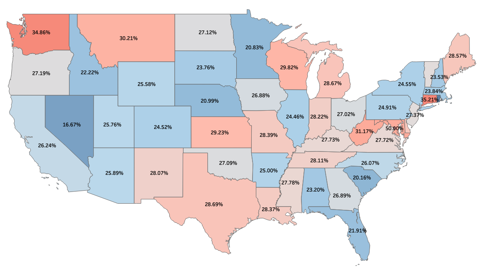
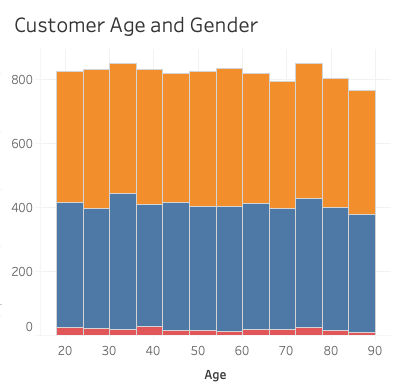

# Dashboard

## Explain how the purpose and function of your dashboard align with the needs outlined in the data dictionary associated with your chosen data set.

My Dashboard is made up of the following visualizations:
1. A map showing the churn rate of each state
2. A pie chart showing overall churn rate
3. Percentages of what customers have phone, internet, or both services
4. A line graph of the nationwide trends of phone and internet subscriptions
5. A bar graph showing the age and gender breakdown of customers

According to the data document, the SVP and EVP are both interested in customer demographics, which the gender bar graph and map help explain. The map also assists the Regional VPs in determining if their region needs extra attention.

## Explain how the variables in the additional data set enhance the insights that can be drawn from the data set you chose from the provided options.

The additional dataset from the World Bank shows the number of phone and broadband internet subscriptions in the United States. By looking at nationwide trends, we can determine which products we should focus on marketing more.

## Explain two different data representations from your dashboard and how executive leaders can use them to support decision-making.

### 1. The map

This visualization can help decision-makers see which regions experience more churn. This can help to determine which areas receive intensified marketing, upgraded services, price adjustments, etc.

### 2. Age/Gender bar chart

Here we can see the two most important demographic features, age and gender, in one graph. This can give decision-makers insight on who their customers are.

## Explain two interactive controls in your dashboard and how each enables the user to modify the presentation of the data.

1. **Age Slider**: Allows users to adjust the age range of the data, default is 18-89 (all). This slider effects all of the visualizations in the graph except for the broadband-phone trend chart, as it uses a different dataset.
2. **State dropdown**: Filters customers by state. All the states and Puerto Rico are selectable. The dropdown also effects all of the visualizations on the graph except for the broadband-phone trend chart.

## Describe how you built your dashboard to be accessible for individuals with colorblindness.

The dashboard uses contrasting colors such as red/blue and orange/blue. The color green is not present on the dashboard at all, as most color-blind people are red/green colorblind.

# Presentation

## Explain how two data representations in your presentation support the story you wanted to tell.

I had a visualization using data from the world bank to show the trend of phone and broadband subscriptions over the past 22 years. This aided in my point that since subscriptions are on the rise, we shouldn't be seeing so many more internet than broadband subscribers churn. 

My second visualization showed how many customers of phone, internet, and both churn. This let me point out that we're losing a higher proportion of internet than phone subscribers.

## Explain how you used audience analysis to adapt the message in your presentation.

All stakeholders have an interest in customer retention, which my main thesis was based on.

## Describe how you designed your presentation for universal access by all audiences.

All visualizations are colorblind friendly. I also made sure to explain what was on the screen so that a visually impaired viewer would be still be able to glean useful information.

## Explain two elements of effective storytelling that you implemented in your presentation and how each element was intended to engage the audience.

I used the **bing-bang-boingo** method as described in *Storytelling with Data* by Cole Nussbaumer Knaflic. This method is:

- Tell your audience what you're going to tell them (Bing)
- Tell it to then (Bang)
- Summarize what you just told them (Boingo)

I also based my presentation on the 3-act structure:

- Act 1 (Setup): Give the context that phone subs are decreasing while internet subs are increasing
- Act 2 (Conflict): Explain that our customer data is the opposite, we lose more internet than phone subs!
- Act 3 (Resolution): Explain to the decision makers that we need to make our internet service more competitive.